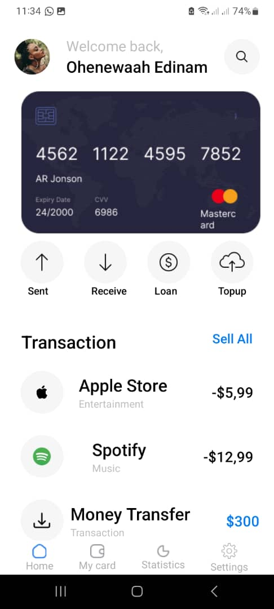
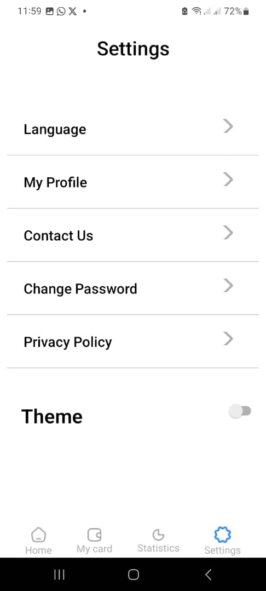
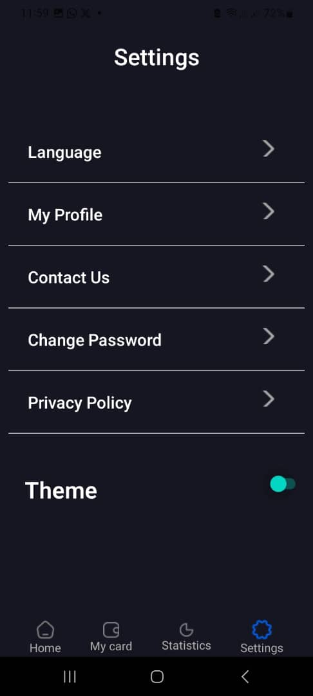

# rn-assignment5-11019725

## A brief description of how I built my application.

- Clone my github repository to my local machine (git clone https://github.com/Ohenewaah09/rn-assignment5-11019725.git)
- Setup the Environment: using Expo CLI
- Initialize the project: npx create-expo-app --template blank
- Name the app(splashZone2)
- Changed directory to app (cd splashZone2)
- Start the app using "npm run start"
- Create a component folder where all the .js file would be kept.
- Images to be used were kept in the assets folder.
- export the .js files to where they are required.
- The .js files created was
  - Home.js
  - Settings.js
  - Footer.js
  - TransactionList.js
  - ThemeContext.js
- Install stack navigation to be employed in the application (App.js).
- the two main Screens to create was HomeScreen and SettingsScreen
- Implemented Context API to change the theme of the app from dark to light upon click on toggle

## Screenshot of App

